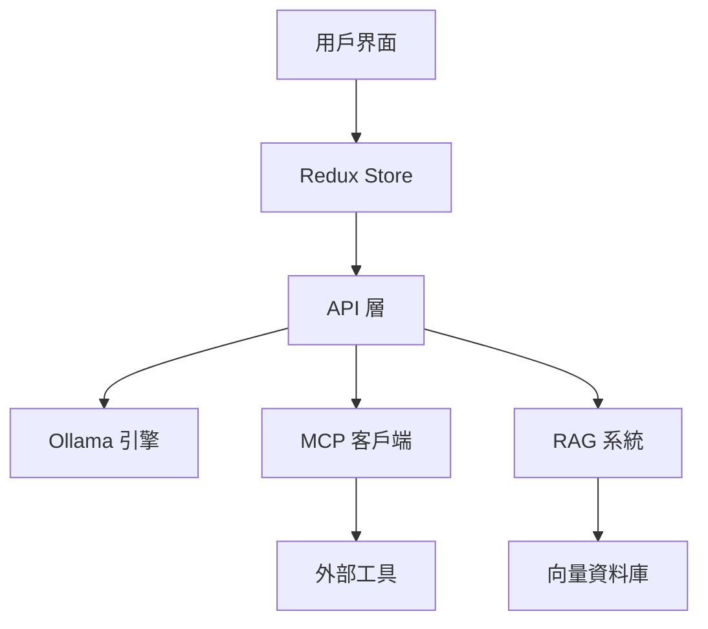
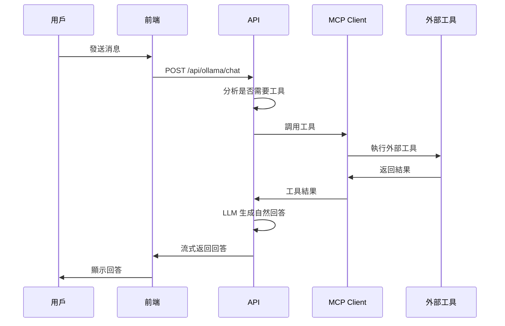

# OllamaChat 開發指南

## 📋 目錄
- [專案概述](#專案概述)
- [架構總覽](#架構總覽)
- [環境設置](#環境設置)
- [目錄結構](#目錄結構)
- [核心模組說明](#核心模組說明)
- [API 設計](#api-設計)
- [MCP 工具整合](#mcp-工具整合)
- [前端架構](#前端架構)
- [狀態管理](#狀態管理)
- [開發流程](#開發流程)
- [部署指南](#部署指南)
- [故障排除](#故障排除)
- [擴展指南](#擴展指南)

---

## 專案概述

OllamaChat 是一個基於 Next.js 的現代化 AI 聊天應用，整合了：
- **Ollama 本地 AI 模型**：支援多種開源 LLM
- **MCP (Model Context Protocol)**：動態工具調用系統
- **RAG (檢索增強生成)**：文檔知識整合
- **多模態支援**：文本、圖片、檔案處理

### 技術棧
- **前端**: Next.js 15, React 19, TypeScript, Tailwind CSS
- **狀態管理**: Redux Toolkit
- **AI 整合**: LangChain, Ollama API
- **工具協議**: MCP (Model Context Protocol)
- **UI 組件**: Shadcn/UI

---

## 架構總覽



### 核心特色
1. **真正的 LLM 工具調用**：不依賴關鍵詞匹配，LLM 自主決策
2. **多層過濾機制**：確保用戶界面乾淨，無技術細節
3. **自動重連系統**：解決頁面刷新後的連接問題
4. **流式響應**：即時的對話體驗

---

## 環境設置

### 系統需求
- Node.js 18+
- pnpm (推薦) 或 npm
- Ollama (本地安裝)

### 安裝步驟

1. **克隆專案**
```bash
git clone <repository-url>
cd ollamachat
```

2. **安裝依賴**
```bash
pnpm install
```

3. **環境配置**
```bash
# 創建 .env.local
NEXT_PUBLIC_OLLAMA_API_URL=http://localhost:11434
```

4. **安裝 Ollama**
```bash
# macOS
brew install ollama

# 下載推薦模型
ollama pull llama3.1:8b
ollama pull llama3.2-vision:11b  # 用於圖片處理
```

5. **啟動開發服務器**
```bash
pnpm dev
```

---

## 目錄結構

```
ollamachat/
├── app/                          # Next.js App Router
│   ├── api/                      
│   │   ├── mcp/                  # MCP 相關 API
│   │   │   ├── connect/          # 連接測試
│   │   │   ├── tools/            # 工具管理  
│   │   │   └── servers/          # 服務器管理
│   │   │       ├── connect/      # 服務器連接
│   │   │       ├── disconnect/   # 服務器斷線
│   │   │       ├── reconnect/    # 自動重連
│   │   │       └── status/       # 狀態查詢
│   │   └── ollama/               # Ollama AI API
│   │       ├── chat/             # 基礎聊天 (整合 MCP)
│   │       ├── generate/         # 文本生成
│   │       ├── show/             # 模型信息
│   │       ├── tags/             # 模型列表
│   │       └── rag/              # RAG 功能
│   ├── components/               # 頁面組件
│   │   ├── AIChat.tsx            # 主應用容器
│   │   ├── ChatMain.tsx          # 聊天主界面
│   │   ├── ChatSidebar.tsx       # 側邊欄
│   │   ├── MessageList.tsx       # 消息列表
│   │   ├── InputArea.tsx         # 輸入區域
│   │   └── MCP*/                 # MCP 相關組件
│   ├── redux/                    # 狀態管理
│   │   ├── chatSlice.ts          # 聊天狀態
│   │   ├── mcpSlice.ts           # MCP 狀態
│   │   ├── modelSlice.ts         # 模型狀態
│   │   └── store.ts              # Store 配置
│   └── globals.css               # 全域樣式
├── components/                   # Shadcn/UI 組件
│   └── ui/                       # 基礎 UI 組件
├── lib/                          # 核心庫
│   ├── mcp-client.ts             # MCP 客戶端管理
│   └── utils.ts                  # 工具函數
├── public/                       # 靜態資源
└── vectorstore/                  # RAG 向量儲存
```

---

## 核心模組說明

### 1. MCP 客戶端管理 (`/lib/mcp-client.ts`)

```typescript
export class MCPClientManager {
  private static instance: MCPClientManager;
  private clients = new Map<string, MCPClient>();
  
  // 單例模式確保全域唯一實例
  static getInstance(): MCPClientManager;
  
  // 支援多種連接類型
  async createClient(id: string, config: MCPClientConfig);
  
  // 工具管理
  async listTools(clientId: string): Promise<MCPTool[]>;
  async callTool(clientId: string, toolName: string, args: any);
}
```

**支援的連接類型**：
- `stdio`：本地命令行工具 (如 Everything MCP Server)
- `http`：HTTP 流式連接
- `sse`：Server-Sent Events 連接

### 2. 聊天 API 整合 (`/app/api/ollama/chat/route.ts`)

核心流程：
1. **工具檢測**：分析用戶消息，判斷是否需要工具
2. **工具執行**：調用相應的 MCP 工具
3. **結果整合**：讓 LLM 基於工具結果生成自然回答
4. **響應過濾**：移除技術細節，確保用戶體驗

```typescript
// 關鍵函數
const generateToolsSystemPrompt = (tools: MCPTool[]) => {
  // 動態生成工具使用指南
};

const parseToolCall = (content: string) => {
  // 解析 LLM 輸出的工具調用
};

const getAvailableTools = async (): Promise<MCPTool[]> => {
  // 獲取所有可用工具
};
```

### 3. 前端狀態管理

**Redux Store 結構**：
```typescript
interface RootState {
  chat: ChatState;      // 聊天消息、檔案上傳
  mcp: MCPState;        // MCP 服務器和工具
  model: ModelState;    // AI 模型配置
  ui: UIState;          // 界面狀態
}
```

**關鍵 Slice**：
- `chatSlice.ts`：消息管理、工具調用狀態
- `mcpSlice.ts`：服務器連接、工具管理
- `modelSlice.ts`：模型選擇和配置

---

## API 設計

### MCP API 端點

| 端點 | 方法 | 功能 | 說明 |
|------|------|------|------|
| `/api/mcp/tools` | GET | 獲取可用工具 | 返回所有已連接服務器的工具 |
| `/api/mcp/servers/connect` | POST | 連接服務器 | 建立新的 MCP 服務器連接 |
| `/api/mcp/servers/disconnect` | POST | 斷開連接 | 安全斷開服務器連接 |
| `/api/mcp/servers/status` | GET | 查詢狀態 | 檢查所有服務器連接狀態 |
| `/api/mcp/servers/reconnect` | POST | 自動重連 | 頁面刷新後重建連接 |

### Ollama API 端點

| 端點 | 方法 | 功能 | 說明 |
|------|------|------|------|
| `/api/ollama/chat` | POST | 聊天對話 | 整合 MCP 工具的主要聊天端點 |
| `/api/ollama/tags` | GET | 模型列表 | 獲取可用 AI 模型 |
| `/api/ollama/show` | POST | 模型詳情 | 查看特定模型信息 |

### 請求/響應格式

**聊天請求**：
```typescript
interface ChatRequest {
  model: string;
  messages: Message[];
  stream?: boolean;
  enableTools?: boolean;
  images?: string[];  // Base64 圖片
}
```

**工具調用響應**：
```typescript
interface ToolCallResponse {
  type: "tool_call";
  tool_call: {
    id: string;
    name: string;
    args: any;
    status: "running" | "completed" | "failed";
    result?: any;
  };
}
```

---

## MCP 工具整合

### 工具調用流程



### 支援的工具類型

1. **數學計算**：`add` - 數字加法
2. **文本處理**：`echo` - 文本回音
3. **系統信息**：`printEnv` - 環境變數
4. **長期任務**：`longRunningOperation` - 演示進度更新
5. **AI 採樣**：`sampleLLM` - LLM 採樣功能
6. **圖片處理**：`getTinyImage` - 返回小圖片
7. **註解消息**：`annotatedMessage` - 元數據展示
8. **資源引用**：`getResourceReference` - 資源引用

### 添加新工具

1. **配置 MCP 服務器**：
```typescript
// 在前端 MCP 工具標籤頁添加服務器
{
  type: "stdio",
  command: "npx",
  args: ["-y", "@modelcontextprotocol/server-your-tool"]
}
```

2. **工具會自動被發現**：
   - 系統自動獲取工具列表
   - 動態生成使用指南
   - LLM 學習如何使用

---

## 前端架構

### 組件層次結構

```
AIChat (根組件)
├── ChatSidebar
│   ├── ModelSelector          # 模型選擇
│   ├── ChatHistory           # 聊天歷史
│   └── MCPToolsTab          # MCP 工具管理
│       ├── AddMCPServerDialog
│       ├── MCPServerCard
│       └── MCPToolItem
└── ChatMain
    ├── MessageList           # 消息展示
    │   ├── MessageItem
    │   └── ToolCallDisplay   # 工具調用展示
    ├── InputArea            # 消息輸入
    └── FileUploadArea       # 檔案上傳
```

### 關鍵組件說明

**InputArea.tsx** - 消息輸入處理：
- 流式響應處理
- 工具調用狀態管理
- 檔案上傳整合
- 累積內容重置邏輯

**MessageList.tsx** - 消息展示：
- Markdown 渲染
- 工具調用結果展示
- 圖片顯示支援

**MCPToolsTab.tsx** - 工具管理：
- 服務器連接管理
- 工具狀態監控
- 自動重連處理

---

## 狀態管理

### Redux Store 配置

```typescript
// store.ts
export const store = configureStore({
  reducer: {
    chat: chatReducer,
    mcp: mcpReducer,
    model: modelReducer,
    ui: uiReducer,
  },
  middleware: (getDefaultMiddleware) =>
    getDefaultMiddleware({
      serializableCheck: {
        ignoredActions: [/* ... */],
      },
    }),
});
```

### 關鍵狀態結構

**ChatState**：
```typescript
interface ChatState {
  chats: Chat[];                    // 聊天對話
  currentChatId: string;           // 當前聊天 ID
  isWaiting: boolean;              // 等待響應狀態
  uploadedFiles: FileData[];       // 上傳檔案
}

interface Message {
  id: string;
  role: "user" | "assistant" | "system";
  content: string;
  timestamp: string;
  toolCalls?: ToolCall[];          // 工具調用信息
  usedTools?: string[];            // 使用的工具列表
}
```

**MCPState**：
```typescript
interface MCPState {
  servers: MCPServer[];            // MCP 服務器配置
  selectedServerId: string | null; // 選中的服務器
  stats: MCPStats;                 // 連接統計
  toolCallHistory: ToolCallRecord[]; // 工具調用歷史
}
```

### 狀態持久化

- 使用 `localStorage` 保存聊天歷史
- MCP 服務器配置自動保存
- 頁面刷新後自動恢復狀態

---

## 開發流程

### 本地開發

1. **啟動 Ollama**：
```bash
ollama serve
```

2. **安裝 MCP 工具**：
```bash
# Everything MCP Server (推薦用於測試)
npx -y @modelcontextprotocol/server-everything
```

3. **啟動開發服務器**：
```bash
pnpm dev
```

4. **測試流程**：
   - 訪問 `http://localhost:3000`
   - 在側邊欄添加 MCP 服務器
   - 測試工具調用功能

### 開發規範

**檔案命名**：
- 組件：`PascalCase.tsx`
- API 路由：`route.ts`
- 工具函數：`camelCase.ts`
- 類型定義：`types.ts`

**程式碼風格**：
- TypeScript 嚴格模式
- ESLint + Prettier
- 組件使用函數式寫法
- 優先使用 Redux Toolkit

**提交規範**：
```
feat(模組): 簡短描述

詳細說明
- 具體改動
- 影響範圍

🤖 Generated with [Claude Code](https://claude.ai/code)
Co-Authored-By: Claude <noreply@anthropic.com>
```

---

## 部署指南

### Vercel 部署 (推薦)

1. **環境變數配置**：
```bash
NEXT_PUBLIC_OLLAMA_API_URL=https://your-ollama-server.com
```

2. **構建配置**：
```json
{
  "builds": [
    {
      "src": "package.json",
      "use": "@vercel/next"
    }
  ]
}
```

### Docker 部署

```dockerfile
FROM node:18-alpine

WORKDIR /app
COPY package*.json ./
RUN npm install

COPY . .
RUN npm run build

EXPOSE 3000
CMD ["npm", "start"]
```

### 注意事項

- Ollama 需要單獨部署
- MCP 工具需要網路可達
- 考慮 CORS 配置

---

## 故障排除

### 常見問題

**1. MCP 工具無法連接**
```bash
# 檢查工具是否可用
npx -y @modelcontextprotocol/server-everything

# 查看連接日誌
# 在瀏覽器開發者工具查看 Console
```

**2. Ollama 連接失敗**
```bash
# 檢查 Ollama 服務
ollama list
curl http://localhost:11434/api/tags

# 檢查模型是否下載
ollama pull llama3.1:8b
```

**3. 頁面刷新後工具丟失**
- 檢查 Redux 狀態是否正確保存
- 確認 `syncServerStatus` 函數運行
- 查看自動重連邏輯

**4. 工具調用不生效**
- 確認 `enableTools` 參數
- 檢查工具定義格式
- 查看 LLM 解析日誌

### 調試技巧

**開啟詳細日誌**：
```typescript
// 在 chat API 中
console.log("[DEBUG] 工具檢測:", toolCall);
console.log("[DEBUG] 可用工具:", availableTools.length);
```

**檢查 Redux 狀態**：
```javascript
// 在瀏覽器 Console
window.__REDUX_DEVTOOLS_EXTENSION_COMPOSE__
```

---

## 擴展指南

### 添加新的 AI 模型

1. **Ollama 模型**：
```bash
ollama pull your-model:tag
```

2. **前端配置**：
```typescript
// 在 ModelSelector 中會自動發現
```

### 開發自定義 MCP 工具

1. **創建 MCP 服務器**：
```typescript
// your-mcp-server.ts
import { MCPServer } from '@modelcontextprotocol/sdk';

const server = new MCPServer({
  name: "your-tool-server",
  version: "1.0.0"
});

server.addTool({
  name: "your_tool",
  description: "Your tool description",
  inputSchema: {
    type: "object",
    properties: {
      param: { type: "string", description: "Parameter description" }
    }
  }
}, async (args) => {
  // 工具邏輯
  return { result: "success" };
});
```

2. **整合到應用**：
```bash
# 在 MCP 工具標籤頁添加
node your-mcp-server.ts
```

### 擴展 RAG 功能

1. **添加新的文檔類型**：
```typescript
// 在 /api/ollama/rag/create_index/route.ts
// 添加新的檔案解析邏輯
```

2. **自定義向量模型**：
```typescript
// 配置不同的 embedding 模型
```

### UI 客製化

1. **主題配置**：
```typescript
// tailwind.config.ts
export default {
  theme: {
    extend: {
      colors: {
        // 自定義顏色
      }
    }
  }
}
```

2. **添加新組件**：
```typescript
// 遵循 Shadcn/UI 規範
// 使用 TypeScript 嚴格類型
```

---

## 總結

OllamaChat 是一個功能豐富、架構清晰的 AI 聊天應用。關鍵特色包括：

1. **模組化設計**：清晰的分層架構，易於維護
2. **MCP 整合**：真正的工具調用生態系統  
3. **用戶體驗**：乾淨的界面，無技術細節干擾
4. **可擴展性**：易於添加新模型、工具和功能

遵循本指南可以快速上手開發，並順利擴展應用功能。如有問題，請檢查相關日誌和狀態，大部分問題都可以通過調試工具快速定位。

---

**最後更新**：2024年12月
**版本**：v1.0.0
**維護者**：開發團隊