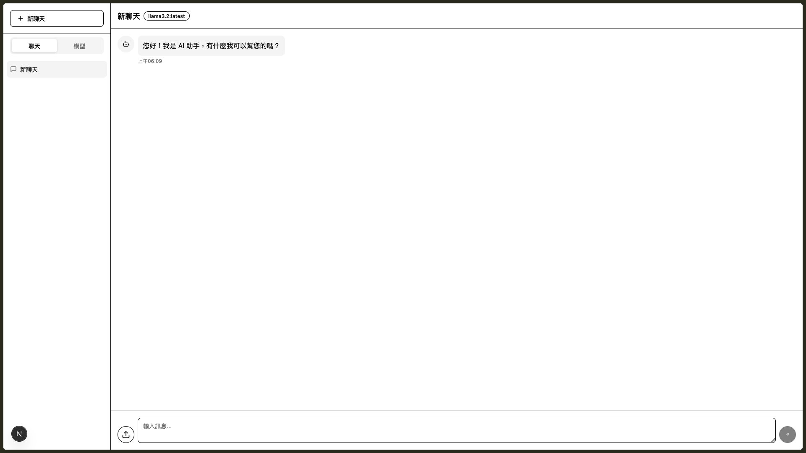

# OllamaChat

[繁體中文](./README.zh-TW.md)

[](https://opensource.org/licenses/MIT)

A brief description of your project. OllamaChat is a chat application that leverages the power of Ollama and LangChain to provide intelligent conversations. It's built with Next.js and Tailwind CSS.

## Features

- Real-time conversations with Ollama models
- User-friendly chat interface
- Markdown support
- Easy to set up and deploy
- Open-source and extensible

## Tech Stack

This project is built with the following modern technologies:

- **Framework**: [Next.js](https://nextjs.org/)
- **UI Library**: [React](https://react.dev/)
- **Language**: [TypeScript](https://www.typescriptlang.org/)
- **Styling**: [Tailwind CSS](https://tailwindcss.com/)
- **UI Components**: [Shadcn/UI](https://ui.shadcn.com/)
- **State Management**: [Redux Toolkit](https://redux-toolkit.js.org/)
- **AI/LLM**: [LangChain](https://www.langchain.com/) & [Ollama](https://ollama.com/)

## Screenshots

Here's a sneak peek of OllamaChat in action:



## Prerequisites

- Node.js (version 20 or higher)
- pnpm (or npm/yarn/bun)
- Ollama installed and running locally. See [ollama.com](https://ollama.com) for installation instructions.

## Installation

1.  Clone the repository:

    ```bash
    git clone https://github.com/your-username/ollamachat.git
    cd ollamachat
    ```

2.  Install the dependencies:

    ```bash
    pnpm install
    ```

## Running the Development Server

To start the development server, run:

```bash
pnpm dev
```

Open [http://localhost:3000](http://localhost:3000) in your browser to see the result.

## Available Scripts

In the `package.json` file, you will find the following scripts:

- `dev`: Starts the development server with Next.js TurboPack.
- `build`: Builds the application for production.
- `start`: Starts a production server.
- `lint`: Runs the Next.js linter to check for code errors.

## Configuration

The application might require some environment variables. Create a `.env.local` file in the root of the project and add the necessary variables.

```
# Example .env.local
OLLAMA_BASE_URL=http://localhost:11434
```

(Add any other environment variables your application needs here)

## Contributing

Contributions are welcome! Please see the [`CONTRIBUTING.md`](./CONTRIBUTING.md) file for details on how you can help.

## Code of Conduct

This project adheres to a [`CODE_OF_CONDUCT.md`](./CODE_OF_CONDUCT.md). By participating, you are expected to uphold this code.

## License

This project is licensed under the MIT License. See the [`LICENSE`](./LICENSE) file for details.
