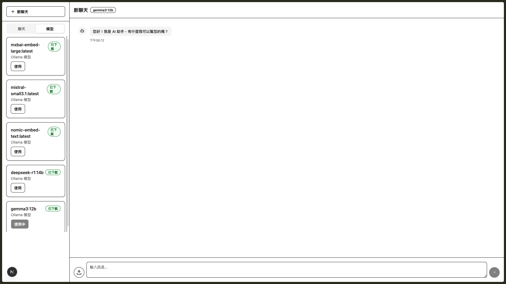
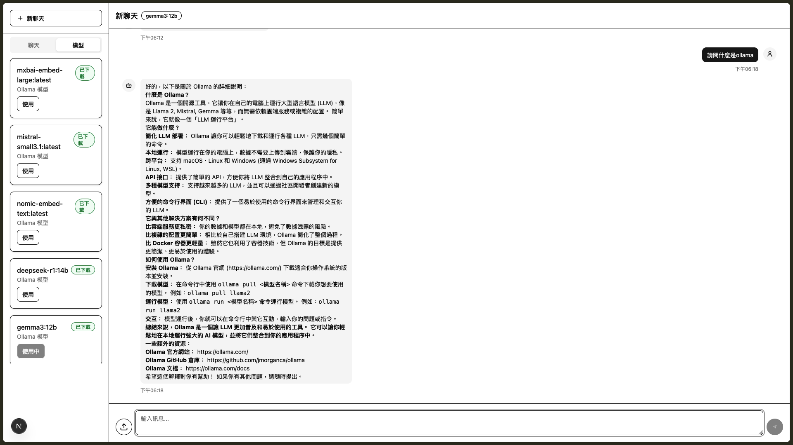
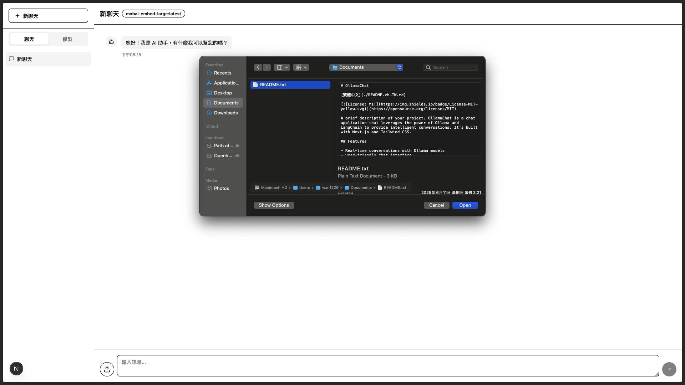
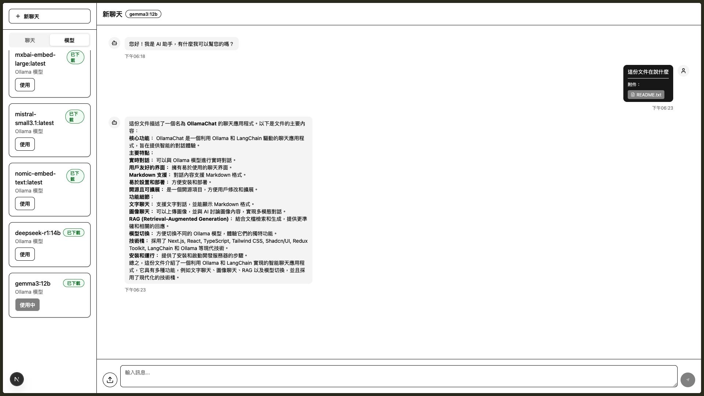

# OllamaChat

[English](./README.md)

[](https://opensource.org/licenses/MIT)

專案的簡短描述。OllamaChat 是一個利用 Ollama 和 LangChain 強大功能的聊天應用程式，可提供智慧對話。它使用 Next.js 和 Tailwind CSS 建構。

## 功能

- 與 Ollama 模型進行即時對話
- 使用者友善的聊天介面
- 支援 Markdown 格式
- 易於設定和部署
- 開源且可擴展

## 相關技術

本專案採用以下現代技術建構：

- **框架 (Framework)**: [Next.js](https://nextjs.org/)
- **UI 函式庫 (UI Library)**: [React](https://react.dev/)
- **程式語言 (Language)**: [TypeScript](https://www.typescriptlang.org/)
- **樣式 (Styling)**: [Tailwind CSS](https://tailwindcss.com/)
- **UI 元件 (UI Components)**: [Shadcn/UI](https://ui.shadcn.com/)
- **狀態管理 (State Management)**: [Redux Toolkit](https://redux-toolkit.js.org/)
- **AI/LLM**: [LangChain](https://www.langchain.com/) & [Ollama](https://ollama.com/)

## 螢幕截圖

以下是 OllamaChat 主要功能的實際操作展示：

### 1. 模型切換

輕鬆切換不同的 Ollama 模型，體驗各種 AI 模型的獨特能力：



### 2. 文字對話

與 AI 進行流暢的文字對話，支援 Markdown 格式顯示：



### 3. 圖片對話

上傳圖片並與 AI 討論圖片內容，支援多模態對話功能：


### 4. RAG 檢索增強生成

結合文件檢索與生成技術，提供更精準且相關的回答：





## 環境需求

- Node.js (版本 20 或更高)
- pnpm (或 npm/yarn/bun)
- Ollama 已在本機安裝並執行。有關安裝說明，請參閱 [ollama.com](https://ollama.com)。

## 安裝

1.  複製儲存庫：

    ```bash
    git clone https://github.com/Yesturnkey/OllamaChat.git
    cd OllamaChat
    ```

2.  安裝依賴項：

    ```bash
    pnpm install
    ```

## 執行開發伺服器

要啟動開發伺服器，請執行：

```bash
pnpm dev
```

在您的瀏覽器中開啟 [http://localhost:3000](http://localhost:3000) 查看結果。

## 可用指令碼

在 `package.json` 檔案中，您會找到以下指令碼：

- `dev`: 使用 Next.js TurboPack 啟動開發伺服器。
- `build`: 為生產環境建構應用程式。
- `start`: 啟動生產伺服器。
- `lint`: 執行 Next.js linter 檢查程式碼錯誤。

## 設定

應用程式可能需要一些環境變數。在專案根目錄中建立一個 `.env.local` 檔案，並新增必要的變數。

```
# .env.local 範例
OLLAMA_BASE_URL=http://localhost:11434
```

（在此處新增您的應用程式需要的任何其他環境變數）

## 貢獻

歡迎各種貢獻！有關如何提供幫助的詳細資訊，請參閱 [`CONTRIBUTING.md`](./CONTRIBUTING.md) 檔案。

## 行為準則

本專案遵守 [`CODE_OF_CONDUCT.md`](./CODE_OF_CONDUCT.md)。參與本專案即表示您同意遵守此準則。

## 授權

本專案採用 MIT 授權。有關詳細資訊，請參閱 [`LICENSE`](./LICENSE) 檔案。
